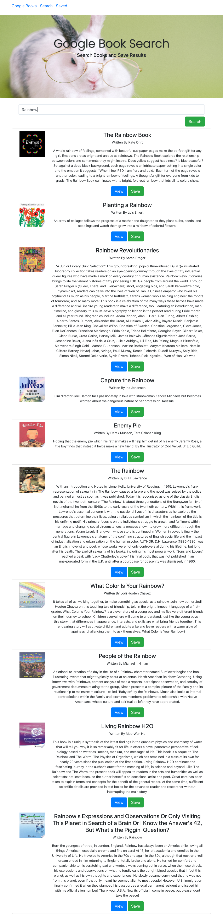
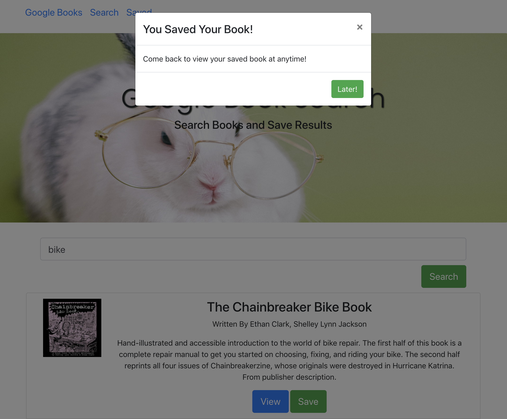

# googlesearch20

# Google Books Search

### Description
The Google Books Search project was set up with Create React App. The react-based app displays the books from a users search. These book searches can be saved to review or pruchase at a later date.

### Deployment
- ##### This App is deployed on:
 - GitHub Pages https://melaniebott2691.github.io/googlesearch20/
 - Heroku https://google-search-20.herokuapp.com/

### Technologies Used
- ##### MERN
  - MongoDB
  - Express.js
  - React.js
  - Node.js
  - Google Books API

### Instructions
User enters search criteria in the `Search` box.
Search results are listed with the option to `view` or `save`.
User can `save` results for viewing later.

### Screen Shots
#### Search Topic

#### Search Results Page

#### Save Result

